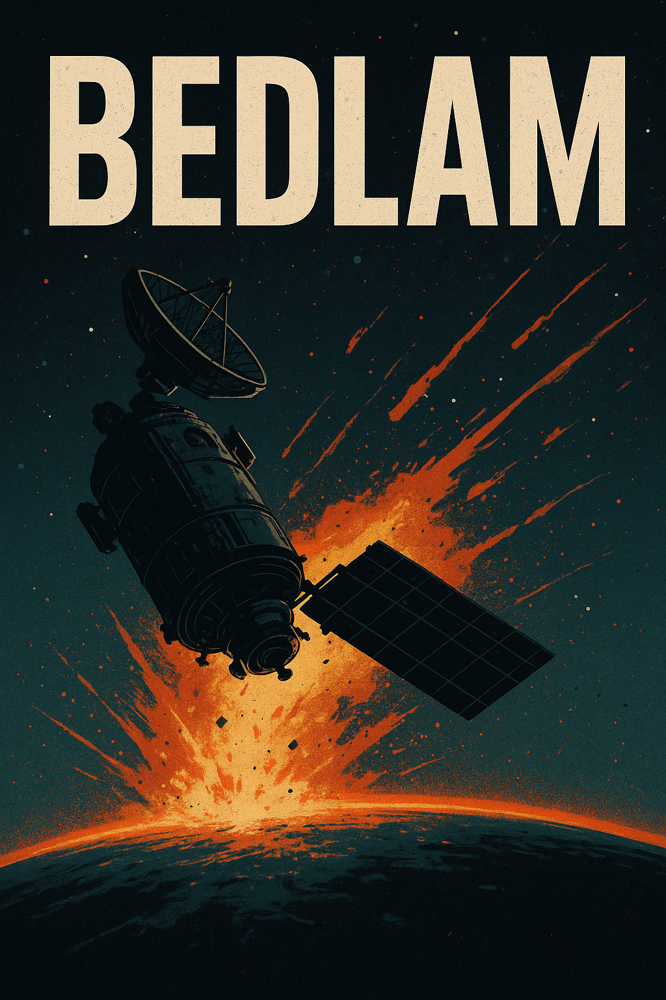

# Bedlam

**Bedlam** is a hard science fiction novel built for instability, speed, and loss of control.

This is not a slow burn. This is a downhill ride where gravity has already taken over and the only question is whether the rider stays upright long enough to reach the bottom.

The story unfolds in near-Earth orbit, inside a military early-warning ecosystem that depends on precise timing, global synchronization, and automated response. A small, impossible observation breaks an assumption the system cannot afford to lose. Once ingested, the system reacts faster than humans can reason about it. Escalation follows. Control narrows. Options collapse.

The book moves because consequences propagate faster than understanding.

## Core Intent

- Relentless forward motion.
- Hard sci-fi under real operational constraints.
- Decisions made under pressure, before certainty.
- Victory is possible, but narrow, costly, and incomplete.
- No savior ending. Survival comes from making systems worse on purpose.

## The Feeling

This novel should feel like riding a bicycle downhill at the edge of control.  
Too fast to stop. Too unstable to relax.  
Every chapter is a steering correction that barely works.

If the writing ever feels calm, elegant, or safe, something has gone wrong.

## Opening Line

> The warning fired early, and that was worse than if it had fired late.

## What This Repo Is For

This repository exists to preserve momentum and intent.

The documents here are guardrails, not destinations.  
They exist to prevent drift back into slow-burn habits and over-explanation.

The manuscript is where the work happens.
